Guide to NetPractice
====================
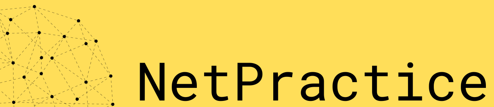

<div id="top"></div>

## Table of Contents
- [Important concepts](#important-concepts)
  - [OSI Model](#OSI-Model)
  - [TCP](#tcp-transport-layer)
  - [IP address](#ip-address-network-layer)
  - [Subnet mask](#subnet-mask)
  - [Switch](#switch)
  - [Router](#router)
- [Levels](#levels)

## Important Concepts

## OSI Model
The OSI model is a conceptual model that is used to describe the different layers of a networked system. It is called the "Open Systems Interconnection" model because it was designed to be used by any networked system, regardless of the specific technologies or protocols that are used.

The OSI model consists of seven layers, each of which performs a specific set of functions within a networked system. These layers are:

<details>
<summary>Physical layer</summary>
This layer is responsible for transmitting the raw bits of data over a physical medium, such as a copper wire or a fiber optic cable.
</details>

<details>
<summary>Data link layer</summary>
This layer is responsible for organizing the raw bits of data into a series of frames that can be transmitted over the physical layer. It is also responsible for error checking and retransmission of lost or corrupted frames.
</details> 

<details> 
<summary> Network layer </summary>
This layer is responsible for routing the frames of data from one device to another across the network. It is also responsible for addressing the frames so that they can be delivered to the correct destination.
</details> 

<details> 
<summary>Transport layer</summary>
This layer is responsible for ensuring that the data is delivered reliably and in the correct order to the destination device. It is also responsible for managing the flow of data between devices to prevent congestion on the network.
</details> 

<details> 
<summary>Session layer</summary>
This layer is responsible for establishing and maintaining a "session" between two devices. This is essentially a logical connection that allows the devices to communicate with each other in a structured way.
</details> 

<details> 
<summary>Presentation layer</summary>
This layer is responsible for formatting the data in a way that is meaningful to the application that is using it. It is also responsible for encrypting and decrypting the data to protect it from unauthorized access.
</details> 

<details> 
<summary>Application layer</summary>
This is the topmost layer of the OSI model, and it is responsible for providing services that are directly used by the applications that run on a networked system. This includes services such as file transfer, email, and web browsing.
</details> 

### TCP: Transport Layer

</br>
<p align="center">
  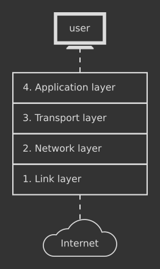
</p>
</br>

TCP stands for **Transmission Control Protocol**. It is a communications standard that enables application programs and devices to exchange messages over a network. It is used to send packets across the internet.

TCP guarantees the integrity of the data being communicated over a network. Before it transmits data, TCP establishes a connection between a source and its destination, which remains active until communication begins. It then breaks large amounts of data into smaller packets, while ensuring end-to-end delivery without loss of any data.

<div align="right">
  <b><a href="#top">↥ back to top</a></b>
</div>
</br>

---

### IP Address: Network Layer

</br>
<p align="center">
  <kbd></kbd>
 height=250 alt="mask"></kbd>
</p>
</br>

IP is part of an internet protocol suite, which also includes the transmission control protocol. Together, these two are known as TCP/IP. The internet protocol suite governs rules for packetizing, addressing, transmitting, routing, and receiving data over networks.

IP addressing is a logical means of assigning addresses to devices on a network. Each device connected to the internet requires a unique IP address.

An IP address has two parts; one part identifies the host such as a computer or other device, and the other part identifies the network it belongs to. TCP/IP uses a [subnet mask](#subnet-mask) to separate them.
</br>
</br>

#### IPv4 vs. IPv6
IP addresses come in 2 versions--IPv4 and IPv6:
<br>
<p align="center">
  <kbd>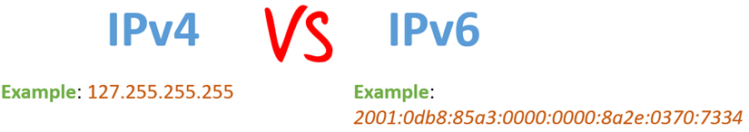</kbd>
</p>
<br>

Internet Protocol version 4 (IPv4) defines an IP address as a 32-bit number. However, because of the growth of the Internet and the depletion of available IPv4 addresses, a new version of IP (IPv6), using 128 bits for the IP address, was standardized in 1998. However, only IPv4 addresses are used in NetPractice.
</br>
</br>

#### Public Address vs. Private Address

A public IP address is an IP address that can be accessed directly over the internet and is assigned to your network router by your internet service provider (ISP). A public (or external) IP address helps you connect to the internet from inside your network, to outside your network.

A private IP address is an address your network router assigns to your device. Each device within the same network is assigned a unique private IP address (sometimes called a private network address) — this is how devices on the same internal network talk to each other.

When a network is connected to the internet, it cannot use an IP address from the reserved private IP addresses. The following ranges are reserved for private IP addresses:
```
192.168.0.0 – 192.168.255.255 (65,536 IP addresses)
172.16.0.0 – 172.31.255.255   (1,048,576 IP addresses)
10.0.0.0 – 10.255.255.255     (16,777,216 IP addresses)
```

<div align="right">
  <b><a href="#top">↥ back to top</a></b>
</div>
</br>

---

### Subnet Mask

</br>
<p align="center">
  <kbd>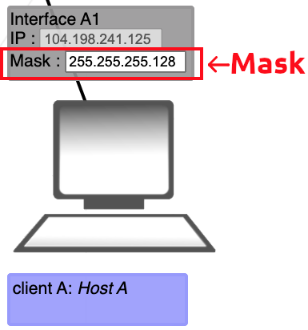</kbd>
</p>
</br>

A subnet mask is a 32 bits (4 bytes) address used to distinguish between a network address and a host address in the IP address. It defines the range of IP addresses that can be used within a network or a subnet.
</br>
</br>

#### Finding the network address

The *Interface A1* above has the following properties:
```
IP address | 104.198.241.125
Mask       | 255.255.255.128  
```

To determine which portion of the IP address is the network address, we need to apply the mask to the IP address. Let's first convert the mask to its binary form:
```
Mask | 11111111.11111111.11111111.10000000
```

The bits of a mask that are 1 represent the network address, while the remaining bits of a mask that are 0 represent the host address. Let's now convert the IP address to its binary form:
```
IP address | 01101000.11000110.11110001.01111101
Mask       | 11111111.11111111.11111111.10000000
```

We can now apply the mask to the IP address through a [bitwise AND](https://en.wikipedia.org/wiki/Bitwise_operation#AND) to find the network address of the IP:
```
Network address | 01101000.11000110.11110001.00000000
```

Which translates to a network address of ``104.198.241.0``.
</br>
</br>

#### Finding the range of host addresses

To determine what host addresses we can use on our network, we have to use the bits of our IP address dedicated to the host address. Let's use our previous IP address and mask:
```
IP address | 01101000.11000110.11110001.01111101
Mask       | 11111111.11111111.11111111.10000000
```

The possible range of our host addresses is expressed through the last 7 bits of the mask which are all 0. Therefore, the range of host addresses is:
```
BINARY  | 0000000 - 1111111
DECIMAL | 0 - 127
```

To get the range of possible IP addresses for our network, we add the range of host addresses to the network address. Our range of possible IP addresses becomes ``104.198.241.0 - 104.198.241.127``.

<ins>HOWEVER</ins>, the extremities of the range are reserved for specific uses and cannot be given to an interface:
```
104.198.241.0   | Reserved to represent the network address.
104.198.241.127 | Reserved as the broadcast address; used to send packets to all hosts of a network.
```

Therefore, our real IP range becomes ``104.198.241.1 - 104.198.241.126``, which could have been found using an [IP calculator](https://www.calculator.net/ip-subnet-calculator.html).
</br>
</br>

#### CIDR Notation (/24)

The mask can also be represented with the Classless Inter-Domain Routing (CIDR). This form represents the mask as a slash "/", followed by the number of bits that serve as the network address.

Therefore, the mask in the example above of ``255.255.255.128``, is equivalent to a mask of ``/25`` using the CIDR notation, since 25 bits out of 32 bits represent the network address.


<div align="right">
  <b><a href="#top">↥ back to top</a></b>
</div>
</br>

---

### Switch

</br>
<p align="center">
  <kbd>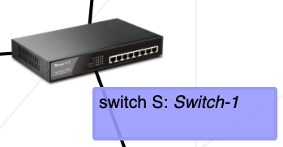</kbd>
</p>
</br>

A switch connects multiple devices together in a single network. Unlike a router, the switch does not have any interfaces since it only distributes packets to its local network, and cannot talk directly to a network outside of its own.

<div align="right">
  <b><a href="#top">↥ back to top</a></b>
</div>
</br>

---

### Router

</br>
<p align="center">
  <kbd></kbd>
</p>
</br>

Just as the switch connects multiple devices on a single network, the router connects multiple networks together. The router has an interface for each network it connects to.

Since the router separates different networks, the range of possible IP addresses on one of its interfaces must not overlap with the range of its other interfaces. An overlap in the IP address range would imply that the interfaces are on the same network.
</br>
</br>

#### Routing Table

</br>
<p align="center">
  <kbd>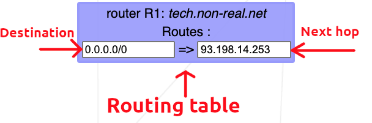</kbd>
</p>
</br>

A routing table is a data table stored in a router or a network host that lists the routes to particular network destinations. In NetPractice, the routing table consists of 2 elements:

- **Destination**: The destination specifies a network address on which a host is the end target of the packets. The route of ``default`` or ``0.0.0.0/0``, is the route that takes effect when no other route is available for an IP destination address. The default route will use the next-hop address to send the packets on their way without giving a specific destination. The default route will match any network.

- **Next hop**: The next hop refers to the next closest router a packet can go through. It is the IP address of the next router on the packet's way. Every single router maintains its routing table with a next hop address.

<div align="right">
  <b><a href="#top">↥ back to top</a></b>
</div>
</br>

## Levels
<details>
  <summary>Level 1</summary>
  <br>
  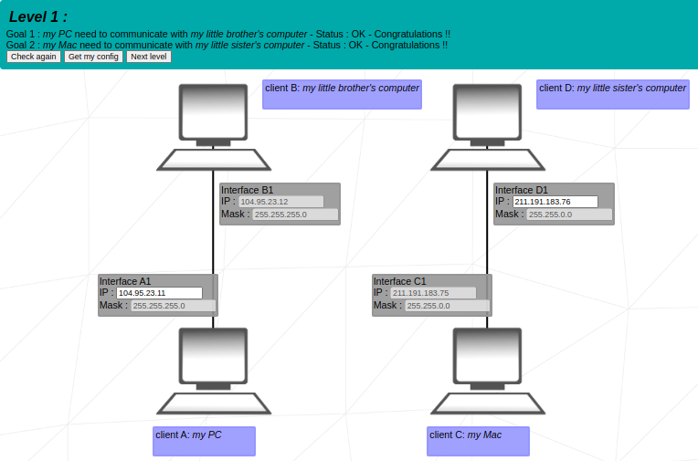  
  <br>
  <br>

**1.** Since *Client A* and *Client B* are on the same network, their IP address must represent the same network in accordance with the subnet mask.
<br>
The subnet mask is *255.255.255.0*, which means that the first 3 bytes of the IP address represent the network, and the 4th byte represents the host. Since we are on the same network, only the host can change. 
<br>
The solution will be anything in the range of **104.96.23.0 - 104.96.23.255** excluding the following 3:
* **104.96.23.0:** The first number in the range of hosts (0 in this case) represents the network and cannot be used by a host.
* **104.96.23.255:** The last number in the range of hosts (255 in this case) represents the broadcast address.
* **104.96.23.12:** This address is already used by the host *Client B*.

**2.** The same reasoning as *1.*, however the subnet mask is *255.255.0.0* in this case. The first 2 bytes of the IP address will represent the network; and the last 2 bytes, the host address.
<br>
The solution will be anything in the range of **211.191.0.0 - 211.191.255.255**, excluding:
* **211.191.0.0:** Represents the network address.
* **211.191.255.255:** Represents the broadcast address.
* **211.191.89.75:** Already taken by host *Client C*.

<div align="right">
  <b><a href="#top">↥ back to top</a></b>
</div>
</br>

</details>

---

<details>
  <summary>Level 2</summary>
  <br>
  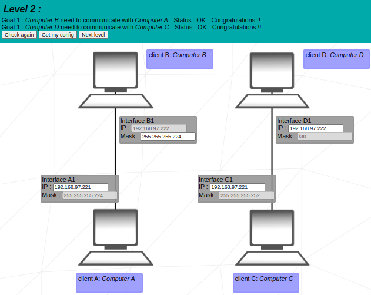
  <br>
  <br>

**1.** Since *Client B* is on the same private network as *Client A*, they should have the exact same subnet mask.
<br>
The solution can only be **255.255.255.224**.

**2.** To understand the subnet mask of *255.255.255.224*, let's look at it in binary form, along with the IP *192.168.20.222* of *Client B*:

<center>

```
MASK: 11111111.11111111.11111111.11100000
IP:   11000000.10101000.00010100.11011101
```
</center>
As we can see, the first 27 bits represent the IP address, while only the last 5 bits represent the host address.
<br>
All these 27 bits representing the network must stay the same in the IP addresses of hosts on the same network. To get the answer, we can only change the last 5 bits.
<br>
<br>
The answer is in the range of:

```
BIN:  11000000.10101000.00010100.11000000 - 11000000.10101000.00010100.11011111
or
DEC:  192.168.20.192 - 192.168.20.223
```
Excluding:
<br>
* **11000000.10101000.00010100.11000000:** Represents the network address (notice all 0 in the last 5 bits).
* **11000000.10101000.00010100.11011111:** Represents the broadcast address (notice all 1 in the last 5 bits).
* **11000000.10101000.00010100.11011110:** *Client B* already has that address.

**3.** Here we are introduced to the slash "/" notation for the subnet mask on *Interface D1*. A subnet mask of */30* means that the first 30 bits of the IP address represent the network address, and the remaining 2 bits represent the host address:
<center>

```
Mask /30: 11111111.11111111.11111111.11111100
```
</center>

We can see that this binary number corresponds to the decimal *255.255.255.252*, therefore it is identical to the mask found on *Interface C1*.
<br>
<br>
The answers can then be any address, as long as they meet the following conditions:
* The network address (first 30 bits) must be identical for *Client D* and *Client C*.
* The host bits (last 2 bits) cannot be all 1, nor all 0.
* *Client D* and *Client C* do not have identical IP addresses.

<div align="right">
  <b><a href="#top">↥ back to top</a></b>
</div>
</br>

</details>

---

<details>
  <summary>Level 3</summary>
  <br>
  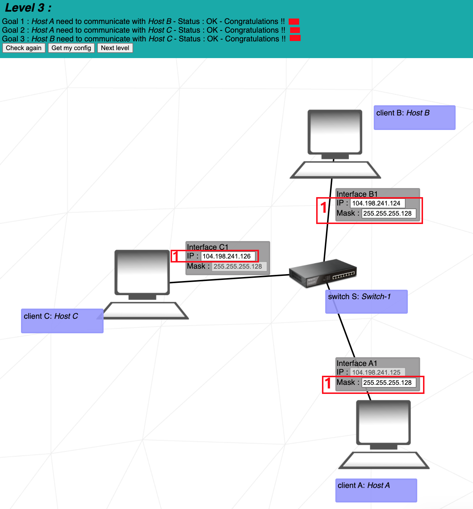
  <br>
  <br>

  This exercise introduces the use of the **switch** (*Switch S* in this example). The switch links multiple hosts of the same network together.
  <br>
  <br>

  **1.** *Client A*, *Client B*, and *Client C* are all on the same network. Therefore, they must all have the same subnet mask. Since *Client C* already has the mask *255.255.255.128*, the mask for *Interface B1* and for *Interface A1* will also be *255.255.255.128* (or in slash notation: */25*).
  <br>
  <br>
  The IP address of *Interface B1* and *Interface C1* must be on the same network range as the IP of *Client A*. This range is:
  <center>

  ```
  104.198.241.0 - 104.198.241.128 
  ```
  </center>
  Excluding of course the network address and the broadcast address.

  <div align="right">
  <b><a href="#top">↥ back to top</a></b>
</div>
</br>

</details>

---

<details>
  <summary>Level 4</summary>
  <br>
  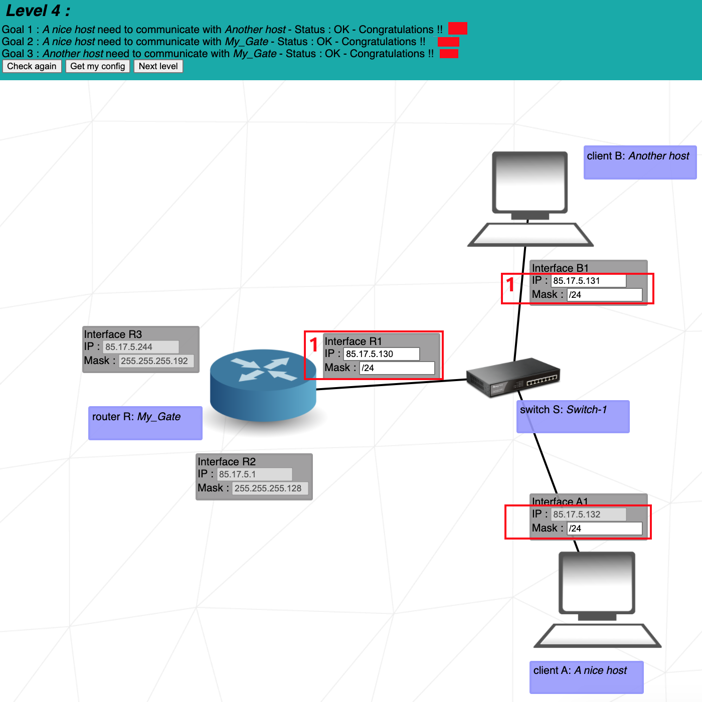
  <br>
  <br>

  This exercise introduces the **router**. The router is used to link multiple networks together. It does so with the use of multiple interfaces (*Interface R1*, *Interface R2*, and *Interface R3* in this example).
  <br>
  <br>

  **1.** Since none of the masks on *Interface B1*, *Interface A1*, and *Interface R1* are entered, we are free to choose our own subnet mask. A mask of **/24** is ideal as it leaves us with the entire 4th byte for the host address, and does not require binary calculations to find the range of possible host addresses.
  <br>
  <br>
  The IP address of *Interface B1* and *Interface R1* must have the same network address as the IP address of *Interface A1*. With a subnet of */24*, the possible range is:
  <center>

  ```
  85.17.5.0 - 85.17.5.255
  ```
  </center>
  Excluding the network address and the broadcast address.
  <br>
  <br>

  Note that we did not interact with the router *Interface R2* and *Interface R3*, since none of our communications had to reach these sides of the router.

  <div align="right">
  <b><a href="#top">↥ back to top</a></b>
</div>
</br>

</details>

---

<details>
  <summary>Level 5</summary>
  <br>
  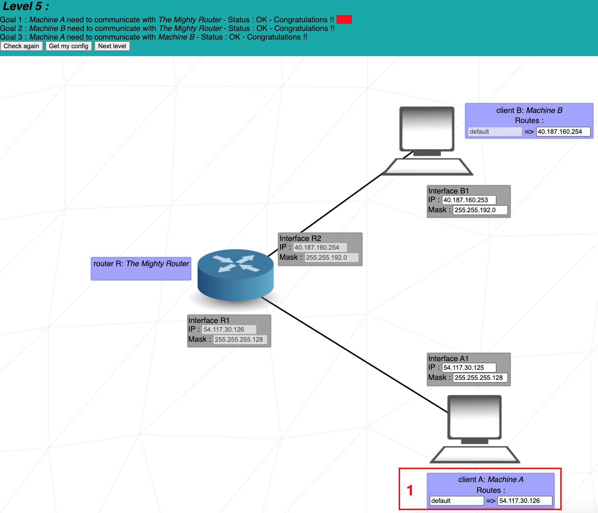
  <br>
  <br>

  This level introduces **routes**. A route contains 2 fields, the first one is the **destination** of outbound packets, the second one is the **next hop** of the packets.
  <br>
  The **destination** *default* is equivalent to *0.0.0.0/0*, which will send the packets i gndiscriminately to the first network address it encounters. A destination address of *122.3.5.3/24* would send the packets to the network *122.3.5.0*.
  <br>
  The **next hop** is the IP address of the next  router (or internet) interface to which the interface of the current machine must send its packets. 
  <br>
  <br>

  **1.** *Client A* only has 1 route through which it can send its packets. There is no use specifying a numbered destination. The destination *default* will send the packets to the only path available.
  <br>
  <br>
  The next hop address must be the IP address of the next router's interface on the packets' way. The next interface is *Interface R1*, with the IP address of *54.117.30.126*. Note that the next interface is not *Interface A1*, since this is the sender's own interface.

  <div align="right">
  <b><a href="#top">↥ back to top</a></b>
</div>
</br>

</details>

---

<details>
  <summary>Level 6</summary>
  <br>
  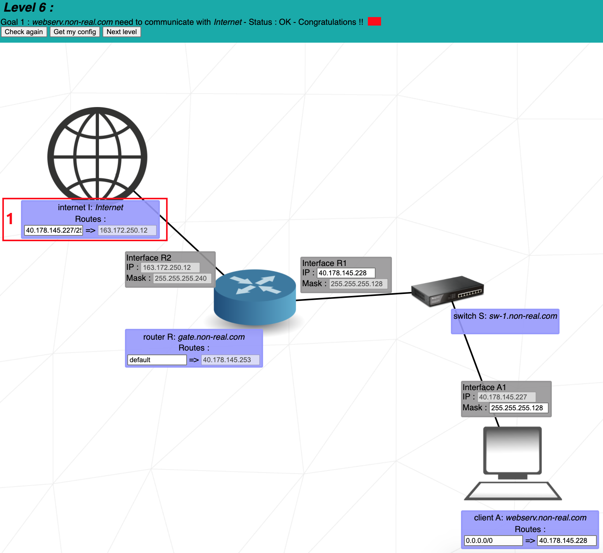
  <br>
  <br>

  This level introduces the **internet**. The internet behaves like a router. However, if an interface is connected directly or indirectly to the internet, it **cannot** have an IP address in the following reserved private IP ranges:


  ```
  192.168.0.0 - 192.168.255.255 (65,536 IP addresses)
  172.16.0.0 - 172.31.255.255   (1,048,576 IP addresses)
  10.0.0.0 - 10.255.255.255     (16,777,216 IP addresses)
  ```
  **1.** The **next hop** of the internet is already entered, and matches the IP address of the *Interface R2*. Therefore we only need to bother with the destination of the internet.
  <br>
  <br>
  The internet must send its packets to *Client A*. To do so, the internet's destination must match the network address of *Client A*. Let's find the network address of *Client A*:
  <br>
  *Client A*'s mask is *255.255.255.128*, which is equivalent to */25*. This means that the first 25 bits of its IP address is its network address. We know then that the first 3 bytes (24 bits) of its IP address makes part of its network address:
  <center>

  ```
  40.178.145.?
  ```
  </center>

  We now only need to find out if the 25th bit is a 1 or a 0.
  <br>
  If we convert the number 227 to binary, we get ``11100011``. The first digit, which corresponds to the 25th bit, is a 1. Since only the 25th bit is part of the network address and not the remaining 7 bits, we get ``10000000`` for the last byte of the network address, which is 128 in decimal.
  <br>
  <br>
  The full network address is:
  <center>

  ```
  40.178.145.128
  ```
  </center>

  With a range of *40.178.145.129 - 40.178.145.254* for its host addresses.
  <br>
  <br>
  We can now put this address of **40.178.145.128** in the Internet destination. The **/25** following the destination address represents the mask applied to its address.
  <br>
  <br>
  A destination of *40.178.145.227/25* is equivalent to the destination address *40.178.145.128/25*, since the mask of */25* will turn all the bits after the 25th to 0 to get the destination's network address.

  <div align="right">
  <b><a href="#top">↥ back to top</a></b>
</div>
</br>

</details>

---

<details>
  <summary>Level 7</summary>
  <br>
  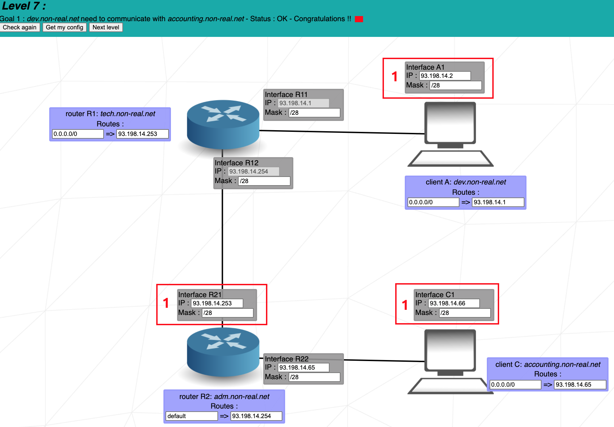
  <br>
  <br>

  This level introduces the concept of **overlaps**. The range of IP addresses of a network must not overlap the range of IP addresses of a separate network. Networks are separated by routers.
  <br>
  <br>

  **1.** We have 3 separate networks:
  <br>

  1. Between *Client A* and *Router R1*.
  2. Between *Router R1* and *Router R2*.
  3. Between *Router R2* and *Client C*.

  For *Interface A1*, we cannot choose our IP address freely since the IP of *Interface R11* is already entered. Also, if we give it a mask of */24*, the IP address range will overlap with the range of *Interface R12*, which is already entered. They would both be in the range of *93.198.14.0 - 93.198.14.255*.
  <br>
  <br>
  Since we need addresses for 3 separate networks, it is convenient to split the last bytes of the address into 4 or more address ranges. We do this by using a mask of */26* or higher. The mask of */28* for example will give us 16 ranges, from which we use the following 3:
  ```
  93.198.14.1 - 93.198.14.14    (Client A to Router R1)
  93.198.14.65 - 93.198.14.78   (Router R1 to Router R2)
  93.198.14.241 - 93.198.14.254 (Router R2 to Client C)
  ```

  To calculate the possible ranges of a mask:
  <br>
  https://www.calculator.net/ip-subnet-calculator.html?cclass=any&csubnet=28&cip=93.198.14.2&ctype=ipv4&printit=0&x=97&y=13

  <div align="right">
  <b><a href="#top">↥ back to top</a></b>
</div>
</br>

</details>

---

<details>
  <summary>Level 8</summary>
  <br>
  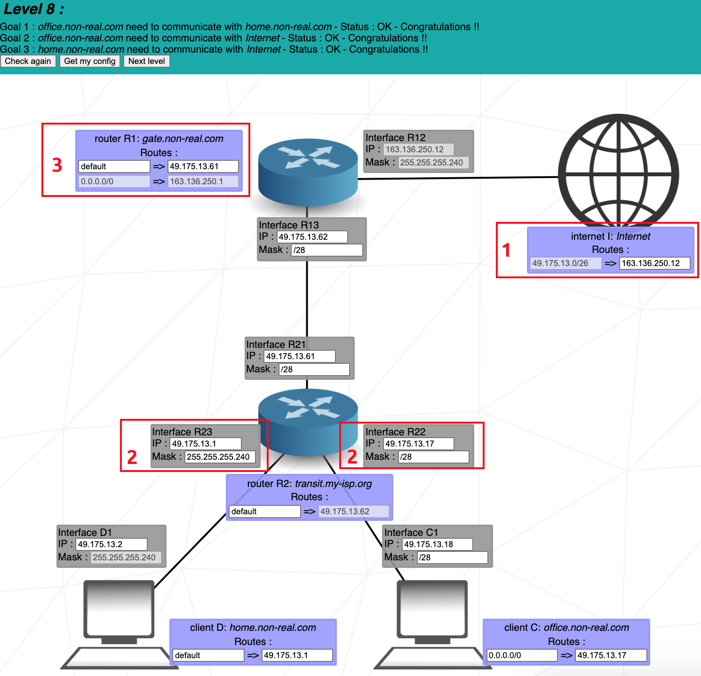
  <br>
  <br>

  **1.** The hosts *Client C* and *Client D* will send packets to the internet, then the internet will respond by sending packets all the way back to the initial sender. To send these packets, the internet uses the destination *49.175.13.0/26* to send the packets to the networks in the range of ``49.175.13.0 - 49.175.13.63``.
  <br>
  <br>
  All the receiving networks must be in this range, without overlapping each other.
  <br>
  <br>

  **2.** On *Interface R23* and *Interface R22* we use the mask *255.255.255.240* (or */28*), to conveniently split the range of */26* from the destination address, into 4 separate ranges. This separation of 4 is necessary since we have the following 3 networks that must not overlap:
  <br>

  1. *Router R1* to *Router R2*.
  2. *Router R2* to *Client C*.
  3. *Router R2* to *Client D*.

  Each of these networks can then be attributed one of the following IP ranges with a mask of */28*:
  ```
  49.175.13.0 - 49.175.13.15
  49.175.13.16 - 49.175.13.31
  49.175.13.32 - 49.175.13.47
  49.175.13.48 - 49.175.13.63
  ```
  Note that the network address (first) and the broadcast address (last) must be excluded from each range.
  <br>
  <br>

**3.** The destination and next hop for the internet are already entered. We only need to enter the next hop for the *Router R2*, which is the IP on the *Interface R21*.

<div align="right">
  <b><a href="#top">↥ back to top</a></b>
</div>
</br>

</details>

---

<details>
  <summary>Level 9</summary>
  <br>
  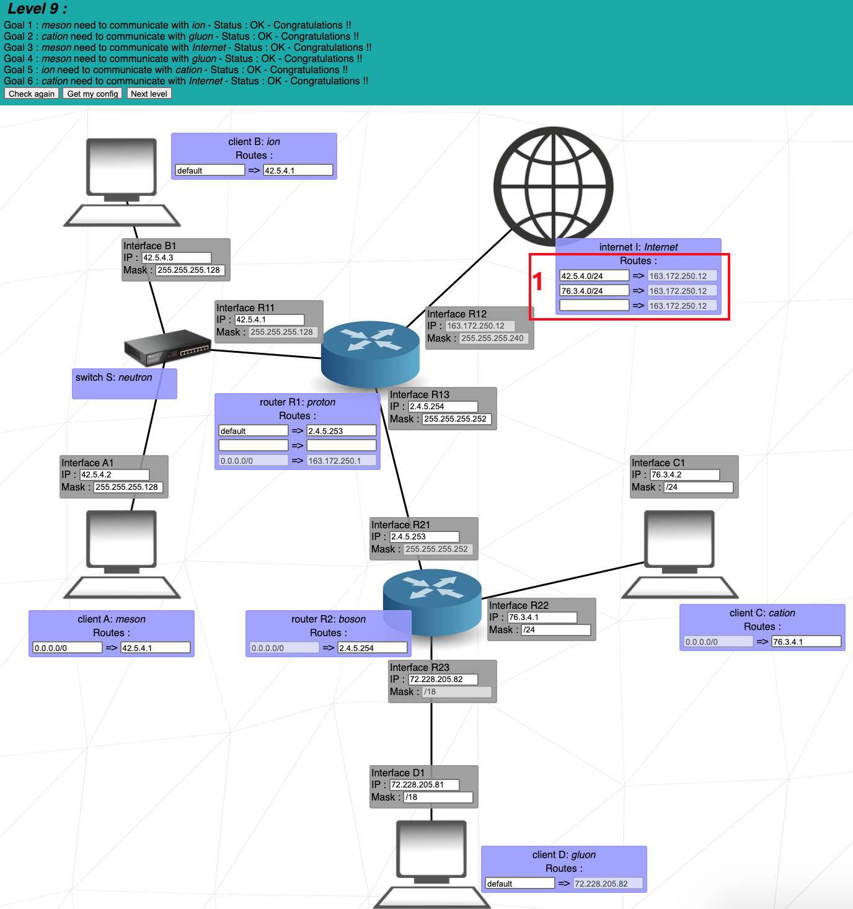
  <br>
  <br>

  This level is quite straightforward since the internet does not initially send its packets to a specific network. Therefore, the separate networks do not need to share a common address range. I would suggest simply following the 6 goals of the level one by one until the level is completed.
  <br>
  <br>
  Remember not to use the network addresses from the reserved private IP ranges.
  <br>
  <br>

  **1.** **Goal 3** states that we must connect *meson* with the *internet*. The *internet* will then have to respond to *meson*, so we enter *meson's* network address in the *internet's* destination.
  <br>
  <br>
  **Goal 6** states that we must connect *cation* with the *internet*, so we enter *cation's* network address in the *internet's* destination.
  <br>
  <br>
  It is normal to have an empty field for the 3rd destination of the *internet*, and in *Router R1's* destination. Not all fields of the routing tables need to be filled.

  <div align="right">
  <b><a href="#top">↥ back to top</a></b>
</div>
</br>

</details>

---

<details>
  <summary>Level 10</summary>
  <br>
  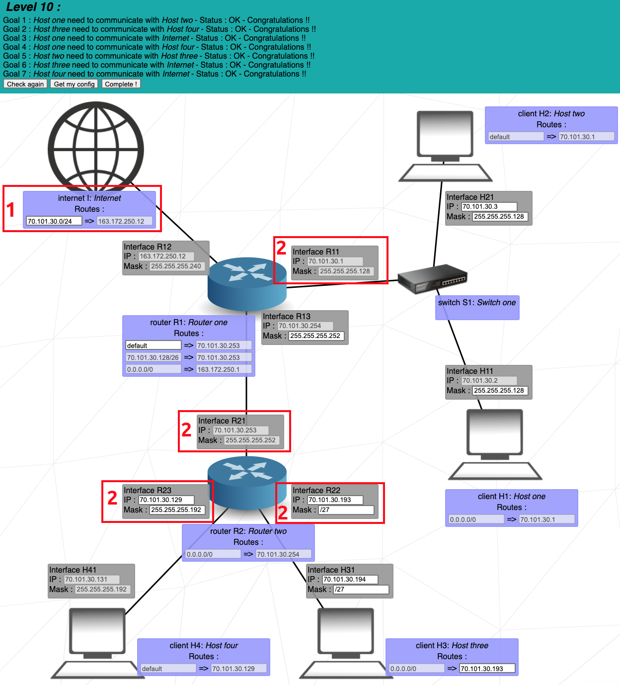
  <br>
  <br>

  At this level, there are 4 different networks:
  <br>

  1. *Router R1* to *Switch S1*
  2. *Router R1* to *Router R2*
  3. *Router R2* to *Client H4*
  4. *Router R2* to *Client H3*
  <br>

  **1.** The internet must be able to send its packets to all the hosts, so its destination must cover the range of networks of all the hosts.
  <br>
  <br>
  *Interface R11* and *Interface R13* already have an IP address entered. This IP address only differs in its last byte. *Interface R11* has for last byte **1**, and *Interface R13* has for last byte **254**. To cover this wide range of IP addresses, we take a mask of **/24** for the *internet's* destination. This destination will cover a range of ``70.101.30.0 - 70.101.30.255``.
  <br>
  <br>

  **2.** When choosing the IP addresses, we must make sure of 2 things:
  <br>

  1. The IP address is covered by the *internet* destination.
  2. The IP address range of the various networks does not overlap.
  <br>
  
  With the IP addresses already entered (greyed out), let's examine the ranges covered by the various networks:
  <br>

  1. *Router R1* to *Switch S1* - Covers the range **70.101.30.0 - 70.101.30.127** (mask /25).
  2. *Router R2* to *Client H4* - Covers the range **70.101.30.128 - 70.101.30.191** (mask /26).
  3. *Router R1* to *Router R2* - Covers the range **70.101.30.252 - 70.101.30.255** (mask /30).
  4. *Router R2* to *Client H3* - ??? (mask ???).

  The only IP addresses left for the network "Router R2 to Client H3" are **70.101.30.192 - 70.101.30.251**. We can pick any mask that will let us take 2 IP addresses from that range to put in *Interface R22* and *Interface R31*.

  <div align="right">
  <b><a href="#top">↥ back to top</a></b>
</div>
</br>

</details>


## Additional information

##### TCP/IP
<details>
<summary> But... what is TCP/IP </summary>
TCP/IP is a suite of communication protocols that are used to interconnect devices on a computer network. It stands for Transmission Control Protocol/Internet Protocol, and it is the foundation of the modern-day internet.

The TCP/IP suite consists of four layers of protocols, each of which performs a specific set of functions to support network communication. These layers are:

The application layer: This is the topmost layer of the TCP/IP suite, and it is responsible for providing services that are directly used by the applications that run on a networked system. This includes services such as file transfer, email, and web browsing.

The transport layer: This layer is responsible for ensuring that the data is delivered reliably and in the correct order to the destination device. It is also responsible for managing the flow of data between devices to prevent congestion on the network.

The internet layer: This layer is responsible for routing the packets of data from one device to another across the network. It is also responsible for addressing the packets so that they can be delivered to the correct destination.

The link layer: This layer is responsible for transmitting the packets of data over a physical medium, such as a copper wire or a fiber optic cable.

Together, these layers of protocols provide the basic framework for communication on a computer network. The TCP/IP suite is used by nearly all devices that are connected to the internet, making it the de facto standard for internet communication. I hope this helps! Let me know if you have any other questions.
</details>

###### TCP
<details>
<summary> What is TCP </summary>
here is a summary of TCP in bullet points:

TCP is a transport layer protocol in the TCP/IP suite of protocols.
It is used to establish and maintain a reliable connection between two devices on a network.
TCP is a connection-oriented protocol, which means it establishes a logical connection before transmitting data.
It ensures that data is delivered reliably and in the correct order by using mechanisms such as sequence numbers and acknowledgement messages.
TCP uses flow control to prevent overloading the network with data.
It is a key component of the modern-day internet and is used by nearly all devices that are connected to the internet.
</details>


###### IP Address

<details>
<summary> What is an IP </summary>
An IP address is a numerical label assigned to each device connected to a computer network that uses the Internet Protocol for communication. An IP address serves two main functions: host or network interface identification and location addressing.

Each IP address is a unique string of numbers that identifies a specific device on a network. For example, a device with the IP address 192.0.2.1 is unique and can be identified by this address on a network. This allows other devices on the network to send and receive data with the device using its IP address.

IP addresses also allow devices on a network to be located in a specific geographic location. This is because IP addresses are typically assigned to a device by its Internet Service Provider (ISP) based on the geographic location of the device. This allows data to be routed efficiently between devices on a network.

There are two main versions of IP addresses currently in use: IPv4 and IPv6. IPv4 addresses are 32-bit numbers typically written in dotted-decimal notation (e.g. 192.0.2.1), while IPv6 addresses are 128-bit numbers written in hexadecimal notation (e.g. 2001:db8::1).
</details>

<details>
<summary> The parts of the IP address </summary>
An IP address is typically written in dotted-decimal notation, which consists of four octets (or groups of eight bits) separated by periods. Each octet represents a different part of the IP address. Here is what the four parts of an IP address typically represent:

Network ID: The first octet of an IP address typically represents the network ID, which identifies the network that the device is a part of.
Subnet ID: The second octet of an IP address typically represents the subnet ID, which identifies a specific subnet within the network.
Host ID: The third and fourth octets of an IP address typically represent the host ID, which identifies a specific device on the network.
In general, the first three octets of an IP address are used to identify the network and subnet that a device is a part of, while the fourth octet is used to identify the specific device on the network. This allows data to be routed efficiently between devices on a network.
</details>

<details>
<summary> IP range </summary>
To calculate the IP range for a subnet, you can follow these steps:

Convert the subnet mask to binary: The first step is to convert the subnet mask to binary. This is because IP addresses and subnet masks are typically written in dotted-decimal notation (e.g. 192.0.2.1), but they are actually represented using binary numbers. To convert a dotted-decimal subnet mask to binary, you can convert each octet separately and concatenate the results. For example, the subnet mask 255.255.255.0 would be represented as 11111111.11111111.11111111.00000000 in binary.

Count the number of 1's in the subnet mask: The next step is to count the number of 1's in the binary representation of the subnet mask. This is because the number of 1's in the subnet mask determines the number of bits that are used for the network and subnet IDs, and the remaining bits are used for the host ID. For example, if the subnet mask has 24 1's in binary (e.g. 11111111.11111111.11111111.00000000), then the first 24 bits of the IP address would be used for the network and subnet IDs, and the last 8 bits would be used for the host ID.

Calculate the IP range: Once you know the number of bits that are used for the network and subnet IDs, you can calculate the IP range for the subnet. To do this, you can use the formula 2^(32-n), where n is the number of bits used for the network and subnet IDs. This formula gives you the total number of possible IP addresses in the subnet. For example, if the first 24 bits of the IP address are used for the network and subnet IDs, then the total number of possible IP addresses in the subnet would be 2^(32-24) = 2^8 = 256.

Determine the first and last IP addresses in the range: To determine the first and last IP addresses in the range, you can use the network and subnet IDs from the original IP address and subnet mask. The first IP address in the range would be the same as the network and subnet IDs, with the host ID set to 0. The last IP address in the range would be the same as the network and subnet IDs, with the host ID set to the maximum value
</details>

<details>
<summary> IPv4 vs IPv6 </summary>
The main differences between IPv4 and IPv6 are the number of bits used for the IP address and the way the IP address is written.

IPv4 uses 32-bit addresses, which allows for a total of approximately 4.3 billion unique IP addresses. IPv4 addresses are typically written in dotted-decimal notation, with each octet representing 8 bits (e.g. 192.0.2.1).

IPv6 uses 128-bit addresses, which allows for a much larger number of unique IP addresses (2^128) and supports more levels of hierarchy in the addressing structure. IPv6 addresses are typically written in hexadecimal notation, with each group of four hexadecimal digits representing 16 bits (e.g. 2001:db8::1).

Another key difference between IPv4 and IPv6 is the way the IP addresses are allocated. In IPv4, IP addresses are typically assigned by an Internet Service Provider (ISP), while in IPv6, devices can generate their own IP addresses using a process called stateless address autoconfiguration (SLAAC).

Overall, the main differences between IPv4 and IPv6 are the number of bits used for the IP address, the way the IP address is written, and the way IP addresses are allocated. I hope this helps! Let me know if you have any other questions.
</details>

<details>
<summary> What's a Subnet Mask Address </summary>
A subnet mask is a 32-bit number that is used in conjunction with an IP address to identify the network and subnet IDs of a device on a network.

It is written in dotted-decimal notation, with each octet representing 8 bits (e.g. `255.255.255.0`). The four parts of a subnet mask represent the number of bits that are used for the network and subnet IDs in the IP address.

For example, if a subnet mask is `255.255.255.0`, the first three octets (24 bits) would be used for the network and subnet IDs, and the last octet (8 bits) would be used for the host ID. This means that there can be a maximum of 256 possible IP addresses in the subnet (2^8).

The subnet mask is used to determine which part of the IP address represents the network and subnet IDs, and which part represents the host ID. This information is then used to route traffic on the network and ensure that each device has a unique IP address.

Subnet masks are typically used in networks that use the IPv4 protocol, as IPv6 uses a different method for identifying the network and subnet IDs.
</details>


##### About Net Practice
This project is a general practical exercise that let me discover networking
</details>
